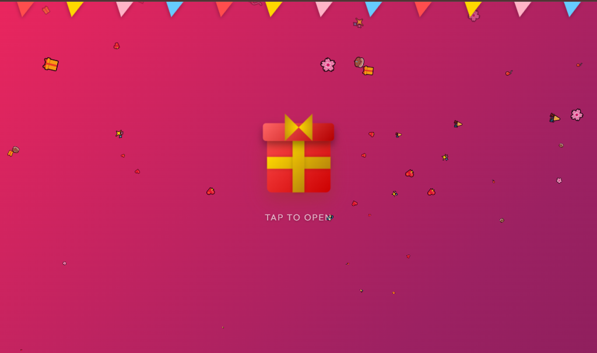
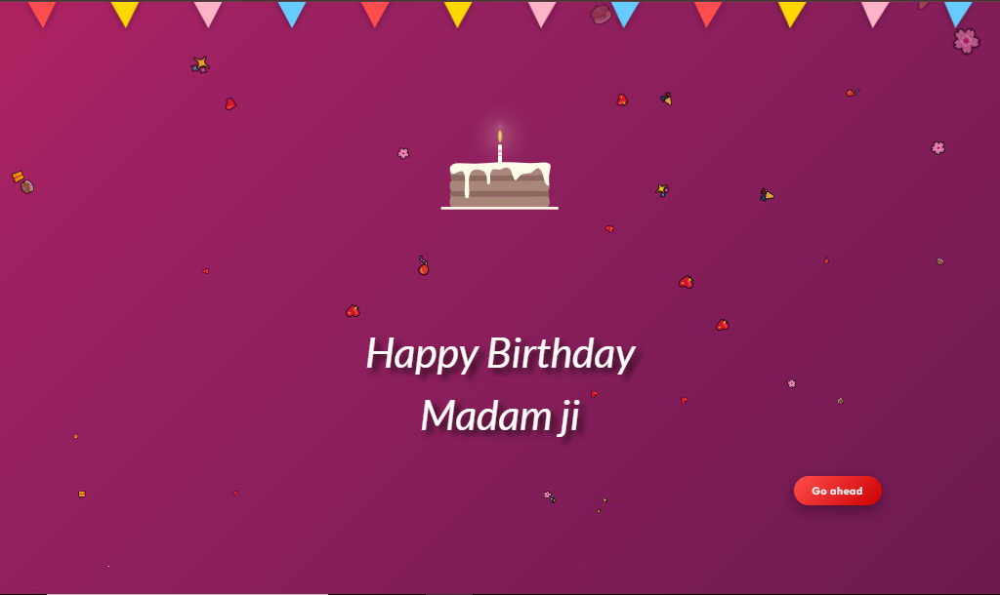
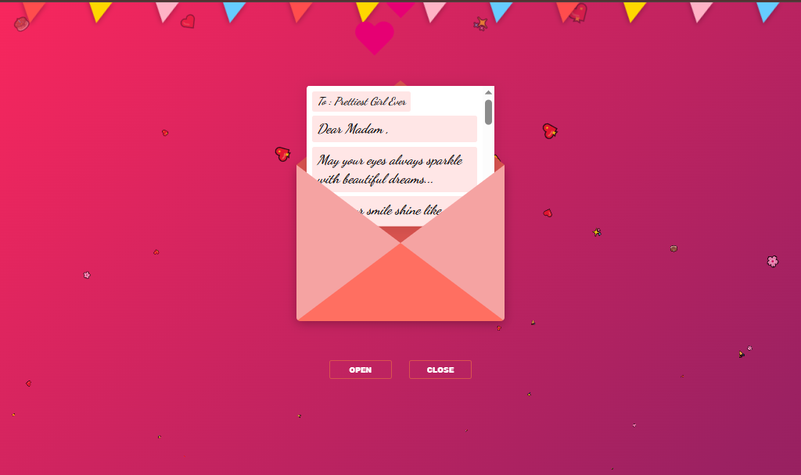

<h1> Happy Birthday, My Love 🎂 Interactive birthday web app Made with ❤️  By  S.D.Nil</h1>

---

Welcome to the official repository for my Happy Birthday Wish project! 
A cozy, multi-scene birthday surprise, made for that special someone 💘

---

## 🌐 Live Demo

---

## 📌 Features

- Tap-to-open gift box with a confetti & heart burst, floating ambient emoji particles, and swinging bunting flags
- Freshly-injected animated birthday cake reveal with a hand-timed SVG icing/candle sequence
- Two-round firework show that spells out "I LOVE YOU" letter by letter across the sky
- Smooth scene handoff via a "Go ahead" button, with background music that hands off cleanly between scenes
- Interactive love-letter envelope with open/close animation and a scrollable, heartfelt handwritten-style message
- Fully mobile-responsive layout with tap-highlight-free, touch-friendly interactions

---

## 🛠️ Built With
- **HTML5**
- **CSS3** (keyframes, SMIL SVG animation, `anime.js` timelines)
- **JavaScript** (DOM manipulation, dynamic scene injection)
- **anime.js** (via CDN)
- **MP3 Audio Integration**
- **Google Fonts** (Dancing Script, Outfit, Playfair Display, Lato, Passion One)

---

## 🧠 Skills Highlighted

### Development
`HTML5`, `CSS3`, `JavaScript`, `DOM Manipulation`, `SVG & SMIL Animation`, `anime.js Timelines`, `Event Handling`, `Audio Autoplay Handling`

### Design Principles
`Multi-Scene Storytelling`, `Romantic Theme`, `Responsive Layout`, `Micro-Interactions`, `Sequenced Motion Design`

---

## 💡 Inspiration

Inspired by the feeling that a birthday wish deserves more than a text message.
Built scene by scene — a gift, a cake, and a letter — to turn a simple "Happy Birthday" into something she can open, watch, and keep.

---

## 📸 Photos

### Gift Box Screen

### Cake & Fireworks

### Love Letter Envelope

---

<h1>✍️ Author</h1>

**S.D.Nil**
Passionate about crafting smooth user experiences and beautiful interfaces.

 
 

---

## 📄 License

This project is open-source and available under the [MIT License](LICENSE).